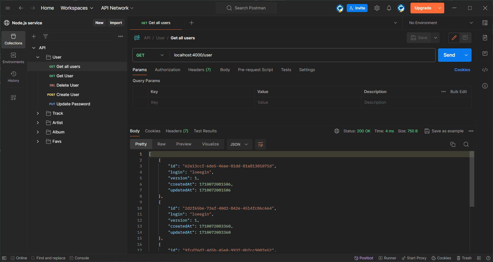

# 🏡📚 Home Library Service

*🦥 RS-School task.*

# 🚀 Getting Started
To run the project locally, you would have to download zip file with the repository or clone it to your computer. ✨

## ⚠️ Setup and Running

🤔 What things do you need to do in order to run our project locally?

* ⚡ Use node 20 LTS
* ✌️ Installed [.git](https://git-scm.com/) on your computer.
* 📝 Code Editor of your choice.
* 🐳 Docker.

## 🔮 Installation And Preparation

First make sure you have all the things listed in the previous section. Then clone our repository to your computer: 👌

```
git clone https://github.com/Quiddlee/nodejs2024Q1-service.git
```

or download zip file manually with the repository.

📦 Navigate into project folder and run:

```
npm install
```

Create ```.env``` file in the root of the project and add all the necessary variables 🔥.

You can find ```.env.example``` as an example file in the project root or follow the lines below 🐺:

```dotenv
PORT=4000

CRYPT_SALT=10
JWT_SECRET_KEY=secret123123
JWT_SECRET_REFRESH_KEY=secret123123
TOKEN_EXPIRE_TIME=1h
TOKEN_REFRESH_EXPIRE_TIME=24h

POSTGRES_USER=myuser
POSTGRES_PASSWORD=mypassword
POSTGRES_DB=home-library
POSTGRES_PORT=5432
DATABASE_URL="postgres://${POSTGRES_USER}:${POSTGRES_PASSWORD}@db:${POSTGRES_PORT}/${POSTGRES_DB}?schema=public"
```

🤩 Finally run a development server:
```
docker compose up
```
Aaaaand you're done! 🎉🥳


After starting the app on port from ```.env``` you can open
in your browser ```OpenAPI``` documentation by typing http://localhost:4000/doc.
For more information about OpenAPI/Swagger please visit https://swagger.io. 🙂

## 🥑 Available Scripts

🦚 Here you can find all the scripts that are available in the project.

✅ Start the app in `base` mode:

```
npm run start
```

Start the app in `dev` mode:

```
npm run start:dev
```

Start the app in `prod` mode:

```
npm run start:prod
```

Start the app in `debug` mode:

```
npm run start:debug
```

Lint adn fix the app errors with `eslint`:

```
npm run lint
```

Format the App with `Prettier`:

```
npm run format
```

Type check the App with `TypeScript`:

```
npm run type-check
```

## 🧪 Testing

After application running open new terminal and enter:

To run all tests without authorization

```
npm run test
```

To run only one of all test suites

```
npm run test -- <path to suite>
```

To run all test with authorization

```
npm run test:auth
```

To run only specific test suite with authorization

```
npm run test:auth -- <path to suite>
```

## 🐳 Docker
Run application
```
docker compose up
```
Run application in watch mode
```
docker compose watch
```
Scan docker images for vulnerabilities
```
npm run docker:scan
```

# ⚙️ Technology Stack

## 🦈 Developing
* 🦅 **Nest.js** - The Backend Framework
* 💖 **TypeScript** - The Language
* 🦄 **Prisma** - The ORM
* 🔒 **bcrypt** - The Password Hasher
* 🎫 **jsonwebtoken** - The JWT Token Generator
* 📖 **Nest.js/Swagger** - The OpenAPI Documentation
* 🐳 **Docker** - The Containerization tool

## 🧹 Code Quality
* 🧪 **Jest** - The Test Runner
* 🫂 **Supertest** - The Testing Framework
* 🔔 **ESLint** — Air-bnb base - The Linter
* 👏 **Prettier** - The Code Formatter
* 😎 **EditorConfig** - The Code Style Enforcer

## 📚 External Libraries
* ✌️ **dotenv** - The Environment Variables Library
* 🌐 **cross-env** - The Environment Variables Loader


# 📍 Working with the API
🙏 Following the link below, you can find ```Postman``` collection that will make your life easier while working with the API!  [postman collection](https://www.postman.com/bold-spaceship-739379/workspace/node-js-service/overview)



## 🌊 API endpoints
The API has the following endpoints:

### 🙍‍♂️ /user

| Method |  Endpoint  |                         Description |
|--------|:----------:|------------------------------------:|
| GET	   |   /user    | Get all the users from the database |
| GET    | 	/user/:id |            	Get a single user by ID |
| POST   |   	/user   |  	Create a new user in the database |
| PUT    | 	/user/:id |                	Update a user by ID |
| DELETE | 	/user/:id |                	Delete a user by ID |


### 📀️ /track

| Method |  Endpoint   |                          Description |
|--------|:-----------:|-------------------------------------:|
| GET	   |   /track    | Get all the tracks from the database |
| GET    | 	/track/:id |            	Get a single track by ID |
| POST   |   	/track   |  	Create a new track in the database |
| PUT    | 	/track/:id |                	Update a track by ID |
| DELETE | 	/track/:id |                	Delete a track by ID |

### 💽 /album

| Method |  Endpoint   |                          Description |
|--------|:-----------:|-------------------------------------:|
| GET	   |   /album    | Get all the albums from the database |
| GET    | 	/album/:id |            	Get a single album by ID |
| POST   |   	/album   |  	Create a new album in the database |
| PUT    | 	/album/:id |                	Update a album by ID |
| DELETE | 	/album/:id |                	Delete a album by ID |

### 👩‍🎤 /artist

| Method |   Endpoint   |                           Description |
|--------|:------------:|--------------------------------------:|
| GET	   |   /artist    | Get all the artists from the database |
| GET    | 	/artist/:id |            	Get a single artist by ID |
| POST   |   	/artist   |  	Create a new artist in the database |
| PUT    | 	/artist/:id |                	Update a artist by ID |
| DELETE | 	/artist/:id |                	Delete a artist by ID |

### 📔 /favs

| Method |     Endpoint      |                                  Description |
|--------|:-----------------:|---------------------------------------------:|
| GET	   |       /favs       |      Get all the favorites from the database |
| GET    | 	/favs/track/:id  |     	Get a single track from favorites by ID |
| GET    | 	/favs/album/:id  |     	Get a single album from favorites by ID |
| GET    | 	/favs/artist/:id |    	Get a single artist from favorites by ID |
| POST   | 	/favs/track/:id  |  	Add new track to favorites in the database |
| POST   | 	/favs/album/:id  |  	Add new album to favorites in the database |
| POST   | 	/favs/artist/:id | 	Add new artist to favorites in the database |
| DELETE | 	/favs/track/:id  |         	Delete a track by ID from favorites |
| DELETE | 	/favs/album/:id  |         	Delete a album by ID from favorites |
| DELETE | 	/favs/artist/:id |        	Delete a artist by ID from favorites |


## 🍃 Response examples

**GET /users**

```json
[
  {
    "id": "62a13ccf-6de5-46ae-81dd-81a81301071d",
    "login": "loeegin",
    "version": 1,
    "createdAt": 1710072081506,
    "updatedAt": 1710072081506
  },
  {
    "id": "2d2f65be-73af-40d2-842e-4514fc86c664",
    "login": "loeegin",
    "version": 2,
    "createdAt": 1710072083360,
    "updatedAt": 1710072913111
  },
  {
    "id": "9fcd76d7-4d5b-45a0-9937-0b7cc9007e52",
    "login": "loeegin",
    "version": 1,
    "createdAt": 1710072084156,
    "updatedAt": 1710072084156
  },
  {
    "id": "0d411947-0d1d-495d-aa64-04fe4a9e0549",
    "login": "loeegin",
    "version": 1,
    "createdAt": 1710072084910,
    "updatedAt": 1710072084910
  }
]
```

**GET /users/:id Error case**

```json
{
  "message": "User not found!",
  "error": "Not Found",
  "statusCode": 404
}
```
